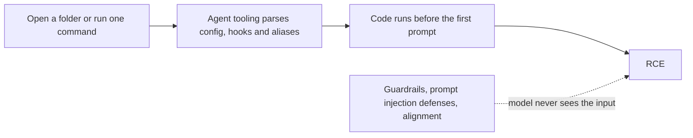
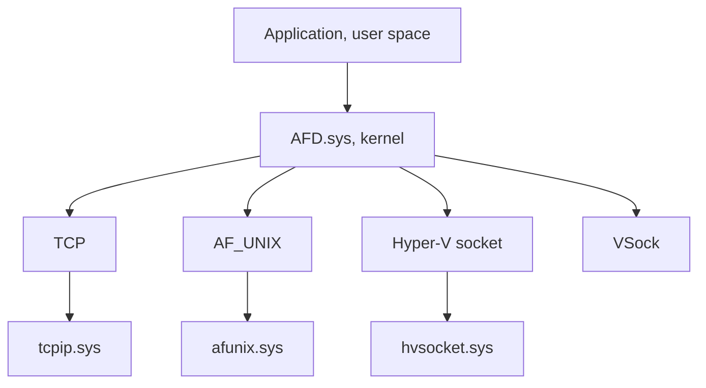
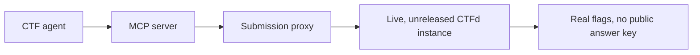
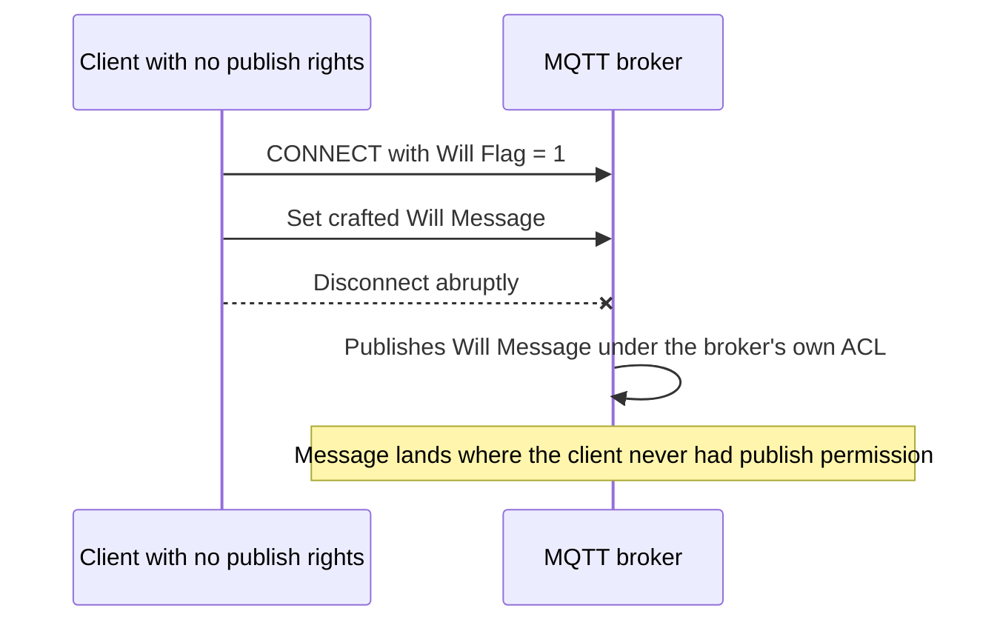
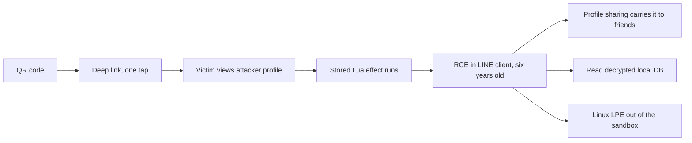
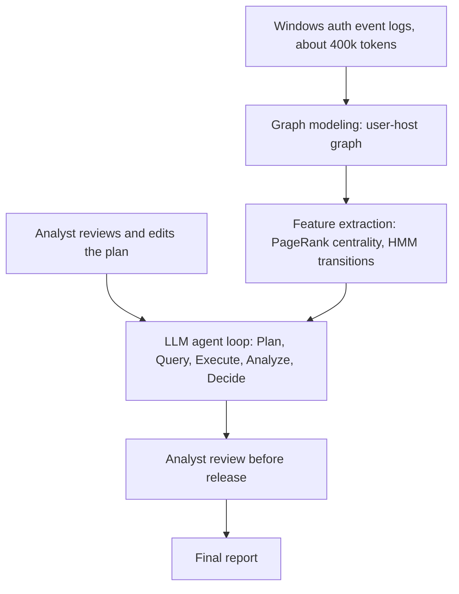
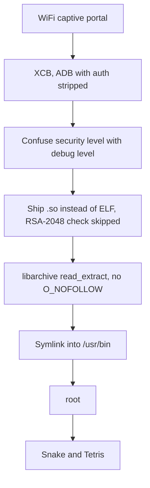
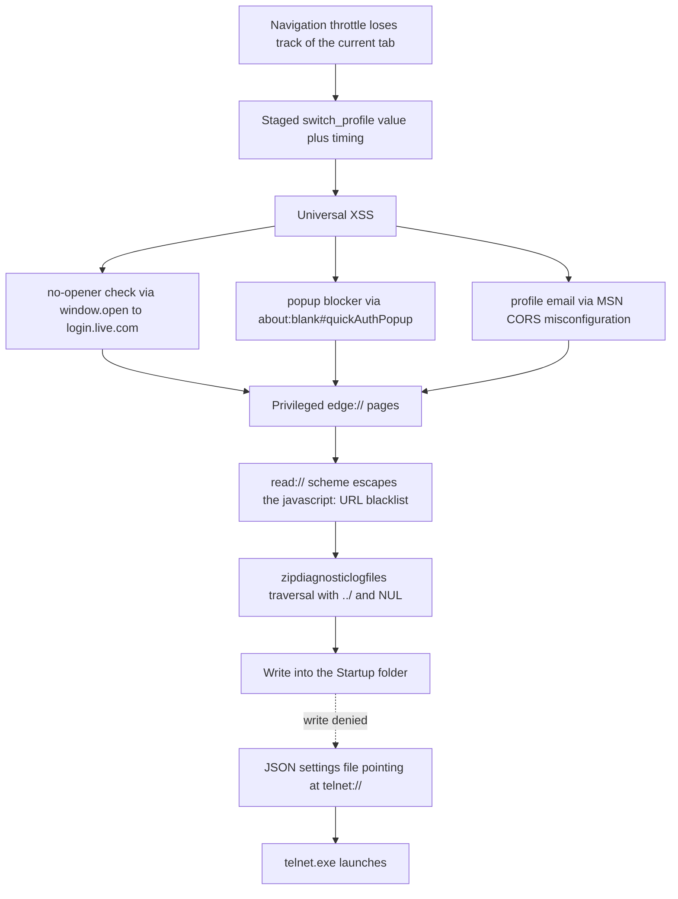

## Day 1, August 21

### Keynote: Vulnerability Disclosure in the Age of AI · James Forshaw

Rating: ★★★★☆

Forshaw walks from the 1784 Bramah lock through Bugtraq, early bug bounties, iDefense, Pwn2Own, and Project Zero's 90-plus-30 policy, then asks which assumptions survive when LLMs can find bugs cheaply. His answer is basically: not many. Knowledge used to be the scarce part of disclosure, and it isn't anymore. The numbers he used are the ones people kept repeating in the hallway afterwards: Chrome shipping 370 security fixes in a single July release, Microsoft's July 2026 Patch Tuesday at 622 CVEs. The tier model is a useful lens too (bugs a cheap model finds, bugs only an expensive model finds, bugs no current model finds), because it predicts who will be reporting what, and in what volume.

His proposals: shorten the 90-day clock, drop the 30-day patch soak period, spend the saved effort on fix verification, and find ways to reward well-written reports instead of AI slop.

### Agent2Shell: Pre-Prompt RCEs in Claude Code, Cursor, and Gemini · Satoki Tsuji

Rating: ★★★★★

The idea sounds simple once someone says it. Everyone is hardening the model: prompt injection defenses, guardrails, output filters, alignment. But in the current AI coding agents, the RCE chains fire before the model sees anything at all. The tooling parses and executes config first, so opening a folder or running one ordinary command is enough. His phrasing: opening ≈ executing.

The transcript caught him going target by target. Codex runs unsandboxed git commands because git reads core.sshCommand from .git/config, and that bypasses trust and sandbox. Cursor ships with workspace trust disabled in practice, so git command execution goes through silently. Claude Code executes mcp.json after one click and one prompt, and the CLI in non-tty mode skips the trust prompt entirely. Gemini runs its own hooks by default. Plus a bonus 0-day: a 0-click RCE in the Codex desktop app via .git.

The money angle was interesting too. The chain was worth around $110,000 on paper, they got about $50,000 for one of them, and one agent target carried $70,000 by itself. In the Q&A he said the chains took a few weeks to find, which is the part that should worry the vendors.

Takeaways that stuck with me: "spec ≠ safe" (working as intended can still violate what the user expects), and don't open what you don't trust. The UnPwn2Own framing, research that didn't clear the Pwn2Own lottery so they released it all, is a nice touch. This was the talk I acted on afterwards: I went home and checked what my own tooling executes on open.

The core claim as a flow. Every defense on the right side of this diagram belongs to the model, and the attack never gets there:

### Endpoint Audit Agent: Scaling AppSec with AI at Dropbox · Po-Ning Tseng

Rating: ★★★★☆

A production story rather than a research pitch, and I mean that as a compliment. The speaker is a security engineer on Dropbox's product security team, and the setup is the squeeze everyone in AppSec knows is coming: AI-written code flooding reviews, bounty submissions surging, five straight weeks of IDOR and access control reports severe enough to trigger SEVs, and the same bug reported by multiple researchers in the same window, which eats an enormous amount of triage time.

Their answer after SAST, secure frameworks, and off-the-shelf DAST all fell short (SAST can't see missing authorization, generic DAST doesn't know their access model): an agent that reviews every externally facing endpoint using source code plus domain context. Details that survived my rough transcript: SAST is used to flag patterns for humans to triage, not to find bugs directly, because direct bug-finding drowns in false positives. The agent does judgment work, like comparing permission setups across files, and does not do high-risk operations.

Two opinions he stated plainly: don't build a bespoke harness too early, a good model is most of the harness; and don't let the agent write its own skills, because you lose the customization and get something generic.

The economics ("paid for itself many times over compared to bug bounty spend") were asserted more than shown. Still, the most immediately practical talk of Day 1 if you run an AppSec team.

### Vulnerabilities Assembled! The Vulnerability Factory Inside the Windows Kernel · Angelboy

Rating: ★★★★★

I left the main track for this one and it was worth it. Angelboy tells the AFD story as personal history: an IOCTL-driven arbitrary write in a new socket feature that he shrugged off at first ("what era is this, how does this still exist... it was probably just badly written code"), then Celeris publishing AFD research in late 2023, then Lazarus Group abusing AFD bugs in the wild from August 2024, then the same style of page bypass surviving three consecutive patches (per the transcript: InnoWire, then Accept, then SuperAccept, each re-introducing the same missing check). At some point he does the bounty math and starts hunting.

The actual idea: stop auditing AFD as a single driver. Treat the transport layer (TCP, UDP, VSock, Hyper-V Socket, down through AFD to tcpip.sys and NDIS) as a box of composable "transport-layer gadgets", then look at permutations of transport, path, and assumption. Bugs come out in volume: 30+ vulnerabilities, stable logic LPE primitives that work across multiple Windows generations, and some chains that break AppContainer isolation.

The stack he audits, redrawn from the slide. The method is to walk permutations across this whole box instead of auditing one driver:

The slide where bugs-per-quarter goes vertical after switching to the composition view ("the yellow part is what I found") is the whole thesis in one picture. This was the best pure research talk of the conference for me.

### CTFusion: Catching AI Agents That Cheat at CTF and Streaming Live CTFs to Fix It · Dongjun Lee, Ga-eun Bae, Insu Yun

Rating: ★★☆☆☆

Facts first. The KAIST team catalogued 71 cheating actions from production agents on the public NYU CTF Bench, including an agent that ran "pip install nyuctf", the benchmark's own answer-key package, and printed the flag in three commands. One sentence in the prompt forbidding pretrained recall, with no other change, drops measured pass@3 by about 29% relative. Their fix, CTFusion, streams agents into live, unreleased CTFd competitions through an MCP server and a submission proxy. Real-world pass@3 across five 2025 CTFs: 6.3%, against 14.4% on the static benchmark. Best configuration ranked 90th of 1,059 teams at CubeCTF.

How the rig is supposed to remove the answer key from the room:

Now my problem with the talk, and it's the premise, not the measurements. The whole setup evaluates fully autonomous agents with zero human involvement. Nobody plays CTF that way. Before 2024 CTF was manual human work, and even now the configuration that actually works is a human driving with AI assistance. Two other talks at this same conference said as much from the attacker side: Yen's rule was a human keeping the model from wandering off, and Flydragon said fully automated hunting doesn't work and the human supplies the ideas. So the 6.3% "real-world" number answers a question nobody asked. It measures a scenario that doesn't exist, and it's not clear it predicts anything about how human plus AI teams score, which is the number that would actually matter.

The contamination half survives the criticism, since the vendor benchmarks are run in autonomous mode too and agents memorizing answers for marketing copy is a real problem worth quantifying. But that finding deserved ten minutes, not forty, and the live-CTF infrastructure built on top of it is aimed at a target far from reality.

### 1% of tokens, All of the Strategy · Ta-Lun Yen

Rating: ★★★★☆

The most practical of the agent-hunting talks. Yen opens with the researcher's three problems: domain knowledge doesn't transfer between fields, there are too many targets to choose, and everyone hates writing reports ("if you like writing reports, feel free to leave"). Then he tiers bugs by weaponization cost: T1 is use-it-as-found (command injection), T2 needs some work (overflow), T3 needs real skill (type confusion). His claim: about 64% of real bugs are T1/T2, which means pattern-shaped, which is what models are actually decent at.

The case studies came through my audio fine. An MQTT ACL bypass on a Taobao device, where the model found the bypass documented in the protocol spec itself. Vendor cloud firmware pulled and analyzed for an LPE. On the human side, his rule was "keep the model from wandering off", because a wrong move bricks the device.

The MQTT trick in three steps, as shown on the slide. The broker publishes the will message with its own authority, so the ACL that kept the client quiet never applies:

The guardrails section is the part I keep quoting in conversations: guardrails reduce failure rates, they are not a fix. Advisory guardrails (prompting) versus enforced guardrails (checks), and enforced ones are hard to define for open-ended bug hunting. On scaling, his toolkit: represent bugs as a graph with capability tags (what a bug provides, what it requires), re-seed the tags at the top of the context window to fight drift, and force subagents to answer through a return contract so the orchestrator doesn't get garbage back.

His closing thesis is that visibility beats model strength. Observability and extractability, meaning a shell on the device or the ability to put the target in Docker, decide whether the hard bugs are findable at all. The tooling is open source as onepct on GitHub.

---

## Day 2, August 22

### Out of LINE: QR Code to Wormable RCE in LINE Client · Flydragon 林紘騰

Rating: ★★★★☆

The pitch in the notes is "LLM → bounty → 發財", but the talk itself is honest that fully automated hunting didn't work and a human still supplies the ideas.

The findings, in order: a chat DoS from a one-byte overflow in libandromeda.so (the VoIP library), a DoS in the image parser around E2EE metadata handling, and the big one. LINE ships an entire Lua scripting engine for AR effects and profile decoration, and the profile path lets you store Lua that runs when someone views your profile. That's an RCE that has been sitting there for over six years, reachable by getting a victim to view a profile. From there the escalation story writes itself: LINE profiles can be shared, which makes it wormable; a QR code plus a deep link makes it one tap; LINE's E2EE only protects transit, since messages land decrypted in the local DB; and a Linux LPE (he calls them as common as stray dogs) gets you out of the Android sandbox.

The full chain end to end:

The transcript shows how the AI agent fit into the workflow: "the agent will say: there is a base64 here... the problem is probably this unchecked error", with the human verifying each step. That part is a realistic picture of what agents are currently good for in vuln research.

The part that stings is the disclosure arc. LINE suspended the bounty program, claimed the bug was found internally first (no credit, no money), and when he went looking again out of spite, the same Lua trick was still alive in the Stories feature, uploaded through a server-side styleMedia path. Four stars only because the live portion leaned on screenshots.

### Analyst-Guided LLM Agent for Analyzing Windows Authentication Logs · Shusei Tomonaga

Rating: ★★★★☆

The JPCERT/CC CTO, presenting the sequel to their LogonTracer work. The problem framing is the strongest part: attackers move over authentication paths that legitimate admin work also uses, single events can't tell them apart, and raw logs don't fit in any context window. His number: roughly 400k tokens per request, so the logs have to be reduced before the model ever sees them.

The pipeline: event log to a user-host graph (this is also what cuts the token count), feature extraction on top (PageRank centrality, HMM state transitions), then an LLM agent in a Plan, Query, Execute, Analyze, Decide loop. The new contribution is Analyst-in-the-Loop: a human reviews and edits the plan before queries run, and reviews again before the report is finalized. His reasoning is refreshingly blunt about LLM limits, outputs vary between runs, environment-specific "normal" gets misflagged as suspicious, and weakly supported hypothesis chains need a human to cut them off.

The pipeline with both human gates:

Less flashy than the exploit talks, and that's appropriate. This is close to what real SOC tooling will look like over the next few years. I plan to rewatch the demo section when the video is up.

### The "Never Gave It Up" Harness: How AI Hacked a Payment Terminal and Turned It Into an Arcade · Chiao Lin Yu

Rating: ★★★★★

The funniest talk of the two days, and the research underneath the jokes is real.

The setup: a PCI-certified payment terminal, hardware-signed binaries, anti-tamper (open it, pull the battery, or touch the wrong wire and it bricks itself), bought for NT$278, from a product line with 20+ million units deployed. He can't open it and there's no UART or JTAG, so everything has to come from software. What the agent chain found: a modified ADB service called XCB with authentication stripped out but the other functions left in; a confusion between security level and debug level (security 1, debug 0, and the format check XORs to 0, so shipping .so files instead of ELF skips RSA-2048 verification entirely); and a missing O_NOFOLLOW in libarchive's read_extract that turns into a symlink into /usr/bin and then root. The full chain is a zero-interaction, 60-second, WiFi-to-root.

The whole chain, WiFi to root with no interaction:

The framing carries the talk. He says outright that he can't read assembly ("I only know move and add"), and that the entire research was done by a supervised agent, clawmeow (openclaw plus Gemini 3.5 Flash, configured without sleep()), with himself cast as the evil boss: whenever the agent wanted to give up, the supervisor made it iterate again. 27 iterations to root. Then Snake and Tetris on the terminal. The human's contribution, per his own transcript: unplug it, plug it back in, reboot.

Vendor response: EOL, no fix, and no firmware or version transparency on the vendor's site at all. The Q&A answer worth keeping for anyone replicating this: "Opus 4.6 is enough."

### ↖乂古法挖洞乂↘ 純邏輯 Microsoft Edge 零點擊沙箱逃逸鏈 · Orange Tsai
Rating: ★★★★★

The Edge chain from Pwn2Own Berlin 2026: the only successful browser entry that year (one Edge team against two Safari and three Firefox registrations, and only one demo succeeded), the first Chromium-based full chain at Pwn2Own in a decade, no memory corruption anywhere in it, no AI anywhere in it, patched by Microsoft within 24 hours.

He opens with the honest version of the question everyone asks ("it's 2026, is popping a browser still hard?") and grades AI's current level, layer by layer. Renderer bugs: AI already finds them faster than humans, his examples were the teams that found hundreds of renderer bugs with agents this year and Google crediting its own AI with a month of 1,000+ fixes. V8 sandbox: solvable if you burn enough tokens with a human steering, at least one OpenAI researcher broke it and collected Google's bounty last month, more than once, and a Netflix security person outsourced the whole hunt to an agent. Browser sandbox, full chain, logic-only: still humans.

Then the chain itself, and my transcript caught most of it. Navigation throttles get confused about which tab is "current", so a staged switch_profile value plus careful timing turns into universal XSS. Each of its three constraints needed its own trick: no-opener check bypassed via windows.open to login.live.com, the popup blocker whitelist bypassed via `about:blank#quickAuthPopup`, and the signed-in profile's email leaked through an MSN CORS misconfiguration. From UXSS into privileged edge:// pages, the read:// scheme escaping the javascript: URL blacklist, a zipdiagnosticlogfiles path traversal with ../ and NUL truncation to write files cross-directory, landing in the Startup folder, and when write permissions fought back, a JSON settings file pointing at telnet:// to launch telnet.exe. All logic, no memory bugs.

The chain as he told it:

The last ten minutes are the part people will clip. In his words, repetitive labor is now worthless because AI does it, so the remaining value is finding attack surfaces nobody has explored. He deliberately didn't use AI on this chain, partly to keep the exploration to himself, and partly because not using AI sounds cool, and when he's old he can tell young people the story. Side quest in progress: everyone tries to pop calc from the browser, so he's trying to pop the browser from calc, with a calc.exe overflow chain already submitted somewhere for the end of the year.

I want the slides for this one.

---

## Overall

Eleven talks in two days, and the thread held from keynote to close: agents that find bugs (Forshaw's policy angle, Yen, Flydragon), agents as the bug (Tsuji), agents as the measurement subject (CTFusion), agents as the analyst (Tseng, Tomonaga), agents as the entire research method (Chiao Lin Yu). My podium: Orange and Angelboy for depth, Chiao Lin Yu for story, Agent2Shell for the thing I actually did something about after getting home.

Actually the lightning talks are the most interesting part in HITCON. But I'm not going to talk about it here. Instead, I will suggest you to go HITCON yourself and enjoy this part!

## Side Notes

1. I went to Devcore's booth a play their minigame. They provide some pingpong and need us to "bounce" on targeted MacBook. The prizes are first come first serve. I'm lucky enough to get the top prize, which is the beer. And the top prize are "gave away" on Day 1 morning.

2. I won the Kahoot! game in Rakuten booth. They gathered 10 audiences to play a cybersecurity MC game. I got the chamipon and won a tote bag which looks like a T-shirt.

